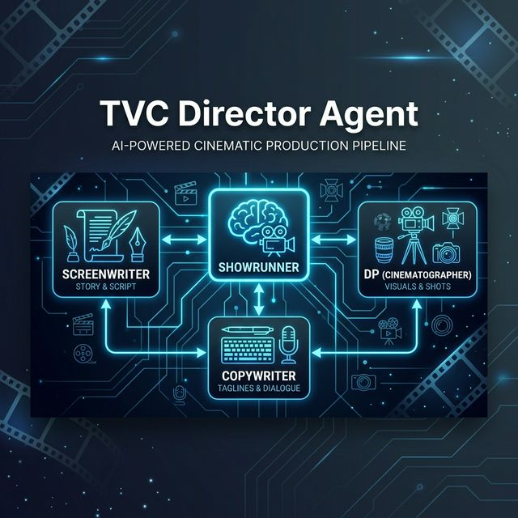
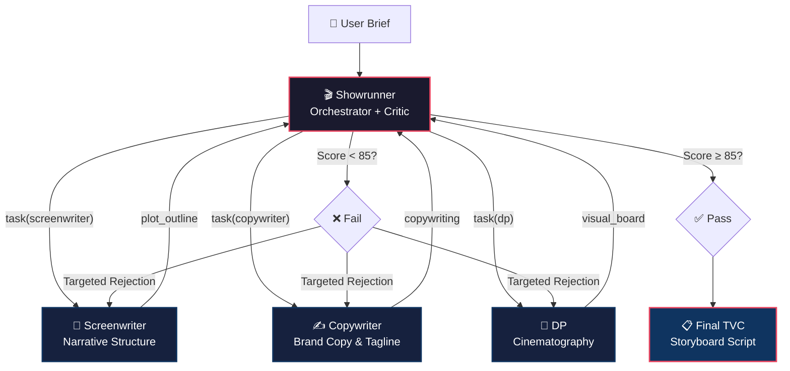

<p align="center">
  
</p>

<h1 align="center">🎬 Deep Director</h1>

<p align="center">
  <strong>AI-Powered Multi-Agent TVC (TV Commercial) Script Director</strong><br>
  <sub>从 Brief 到完整分镜头脚本，一键生成专业级广告剧本</sub>
</p>

<p align="center">
  <a href="#features">Features</a> •
  <a href="#architecture">Architecture</a> •
  <a href="#quick-start">Quick Start</a> •
  <a href="#usage">Usage</a> •
  <a href="#prompt-system">Prompt System</a> •
  <a href="#tech-stack">Tech Stack</a>
</p>

---

## ✨ What is this?

**TVC Director Agent** is a multi-agent AI system that generates professional-quality **TV commercial scripts** — complete with narrative structure, brand copywriting, and cinematography direction — from a simple creative brief.

> **Input**: A brand brief (product, audience, pain points, style, duration)
> **Output**: A production-ready TVC storyboard script with shot-by-shot breakdown

Instead of a single monolithic LLM call, this project uses a **Showrunner + 3 Specialist Sub-Agent pipeline** that mirrors how a real ad production team works:

```
User Brief → 🎬 Showrunner (Director)
                  ├── 📝 Screenwriter  → Plot structure & narrative arc
                  ├── ✍️ Copywriter    → Brand copy, voiceover & tagline
                  ├── 🎥 DP            → Shot design, camera & lighting
                  └── 🔍 Self-Review   → Quality gate (85/100 pass threshold)
              → Final TVC Storyboard Script
```

## 🏗️ Architecture

<a name="architecture"></a>



### Key Design Decisions

| Decision | Rationale |
|----------|-----------|
| **4-Agent Pipeline** | Separation of concerns — each agent has focused expertise and dedicated prompt engineering |
| **Showrunner as Critic** | Self-review with 100-point scoring system prevents low-quality output from reaching users |
| **DeepSeek Dual-Model** | V3 (`deepseek-chat`) for fast web interactions, R1 (`deepseek-reasoner`) for max-quality CLI |
| **LangGraph + DeepAgents** | State management, checkpointing, and human-in-the-loop support out of the box |
| **Book-Sourced Prompts** | Each agent's system prompt is reverse-engineered from acclaimed industry textbooks |

## 🚀 Quick Start

<a name="quick-start"></a>

### Prerequisites

- [Docker](https://docs.docker.com/get-docker/) & Docker Compose
- [DeepSeek API Key](https://platform.deepseek.com/) (required)
- [LangSmith API Key](https://smith.langchain.com/) (optional, for tracing)

### Option 1: Docker Compose (Recommended)

```bash
# 1. Clone the repo
git clone https://github.com/ferzat0918/deep-director.git
cd deep-director

# 2. Configure environment
cp .env.example .env
# Edit .env and fill in your DEEPSEEK_API_KEY

# 3. Launch everything
docker compose up --build -d

# 4. Open the chat UI
# Frontend: http://localhost:3000
# API:      http://localhost:8123
```

### Option 2: Local Development

```bash
# 1. Clone & setup
git clone https://github.com/ferzat0918/deep-director.git
cd deep-director

# 2. Create virtualenv
python -m venv .venv
source .venv/bin/activate   # Windows: .venv\Scripts\activate

# 3. Install dependencies
pip install -r requirements.txt

# 4. Configure
cp .env.example .env
# Edit .env and fill in your DEEPSEEK_API_KEY

# 5a. Run with LangGraph Dev Server (Web UI)
langgraph dev

# 5b. Or use the interactive CLI (uses DeepSeek R1 for best quality)
python scripts/chat.py
```

## 📖 Usage

<a name="usage"></a>

### Web Chat UI

After launching with Docker Compose, open `http://localhost:3000` and start a conversation:

```
请帮我生成一个 TVC 广告脚本：
品牌/产品：某降噪耳机品牌
目标受众：一线城市 25-35 岁的职场通勤白领
核心痛点：每天地铁通勤噪音轰炸，无法在碎片时间获得内心平静
风格：惊悚/紧张 转 温馨/治愈
时长：60 秒
```

### CLI Chat (Highest Quality)

The terminal script uses DeepSeek R1 by default for maximum reasoning quality:

```bash
python scripts/chat.py
```

### Required Brief Fields

| Field | Required | Description |
|-------|----------|-------------|
| `品牌名` (Brand) | ✅ | Official brand name |
| `产品` (Product) | ✅ | Product description & core features |
| `目标受众` (Audience) | ✅ | Age / gender / lifestyle |
| `核心痛点` (Pain Points) | ✅ | Core audience struggles |
| `风格` (Style) | ✅ | Visual style / mood |
| `时长` (Duration) | ✅ | 15s / 30s / 60s |
| `产品类型` (Type) | Optional | Functional / Emotional |
| `投放渠道` (Channel) | Optional | TV / Social / OOH |

## 📚 Prompt System

<a name="prompt-system"></a>

The core differentiator of this project is its **prompt engineering** — each agent's system prompt is meticulously reverse-engineered from acclaimed advertising and storytelling textbooks:

### Agent → Prompt Framework Mapping

| Agent | Prompt Source | What It Provides |
|-------|---------------|-------------------|
| 📝 **Screenwriter** | Robert McKee《*Story*》 + Blake Snyder《*Save the Cat*》 | McKee narrative grammar (Hook → Gap → Crisis → Intervention) + 15-Beat timeline structure + 10 Genre engines |
| ✍️ **Copywriter** | Donald Miller《*Building a StoryBrand*》 + Luke Sullivan《*Hey Whipple, Squeeze This*》 | SB7 brand-as-guide positioning + 4 creative engines (Exaggeration, Metaphor, Reversal, Absurdity) |
| 🎥 **DP** | Christopher Kenworthy《*Master Shots*》 | Camera power dynamics, adaptive style mapping, shot-by-shot visual grammar |
| 🎬 **Showrunner** | All of the above (unified critic) | 100-point scoring checklist, 14 forbidden rules, cross-agent consistency verification |

### Prompt Files

```
prompts/
├── Universal_TVC_Director_OS.md          # McKee narrative engine
├── SaveTheCat_Master_TVC_Director_OS.md  # 15-Beat structure
├── SaveTheCat_Genre_Library.md           # 10 TVC genre adapters
├── StoryBrand_Master_TVC_Director_OS.md  # SB7 brand positioning
├── HeyWhipple_Master_TVC_Director_OS.md  # Creative concept engines
├── MasterShots_Camera_Director_OS.md     # Shot design & cinematography
└── Showrunner_Critic_OS.md               # Quality gate & critic system
```

### Quality Gate (Showrunner Critic)

The Showrunner evaluates every script against a **100-point checklist** across 6 dimensions:

| Dimension | Points | Key Rules |
|-----------|--------|-----------|
| Gap & Tension Curve | 20 | Tension must escalate; no easy resolutions |
| Brand Mentor Positioning | 20 | Brand = Guide, never Hero; no premature product placement |
| 3-Second Hook | 15 | In Media Res opening; no boring establishing shots |
| Audio-Visual Grammar | 15 | Camera follows power dynamics; no unmotivated shots |
| Copy & Subtext | 15 | No on-the-nose dialogue; no ad-speak jargon |
| Catharsis & CTA | 15 | Earned emotion; clear CTA; creative product reveal |

**Pass threshold: 85/100**. Any of 14 `FORBIDDEN` rules triggered = **instant fail**.

## 🛠️ Tech Stack

<a name="tech-stack"></a>

| Layer | Technology |
|-------|------------|
| **Agent Framework** | [LangGraph](https://github.com/langchain-ai/langgraph) + [DeepAgents](https://github.com/deepagents/deepagents) |
| **LLM** | [DeepSeek](https://deepseek.com) V3 / R1 (via OpenAI-compatible API) |
| **Frontend** | [Agent Chat UI](https://github.com/langchain-ai/agent-chat-ui) (Next.js 15 + React 19) |
| **Database** | PostgreSQL 16 (conversation history & checkpointing) |
| **Deployment** | Docker Compose (3-service stack) |
| **Observability** | [LangSmith](https://smith.langchain.com/) tracing |

## 📁 Project Structure

```
deep-director/
├── src/
│   ├── agent.py           # Main agent factory — Showrunner + 3 Sub-agents
│   └── prompts.py         # Prompt loader (composes OS files per agent)
├── prompts/               # 7 "Operating System" prompt files (from 5 books)
├── scripts/
│   ├── chat.py            # Interactive CLI chat (uses DeepSeek R1)
│   └── test_run.py        # Automated test with sample brief
├── frontend/              # Next.js chat UI (LangChain Agent Chat UI)
├── docker-compose.yml     # One-command deployment (Backend + Frontend + PostgreSQL)
├── Dockerfile             # Backend container (LangGraph API Server)
├── langgraph.json         # LangGraph graph registry
├── requirements.txt       # Python dependencies
└── .env.example           # Environment variable template
```

## 📄 License

This project is for educational and personal use.

## 🙏 Acknowledgments

Built on the shoulders of giants — both human and AI:

- **Robert McKee** — *Story: Substance, Structure, Style and the Principles of Screenwriting*
- **Blake Snyder** — *Save the Cat! The Last Book on Screenwriting You'll Ever Need*
- **Donald Miller** — *Building a StoryBrand*
- **Luke Sullivan** — *Hey Whipple, Squeeze This: The Classic Guide to Creating Great Ads*
- **Christopher Kenworthy** — *Master Shots: 100 Advanced Camera Techniques*
- [LangGraph](https://github.com/langchain-ai/langgraph) & [DeepAgents](https://github.com/deepagents/deepagents) frameworks
- [DeepSeek](https://deepseek.com) for powerful, affordable LLM inference
